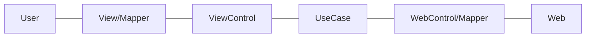

### 取得情報(情報元)
- 店舗名,企業名
- 電話番号
- メールアドレス
- 所在地
- ホームページURL
- 問い合わせフォームURL

### 命名規則
|項目|規則|例|
|----|----|----|
|ファイル名|スネーク|example_file|
|クラス名|パスカル|ExampleClass|

### アーキテクチャ

```mermaid
flowchart LR
    A[User] ---
    B[View/Mapper] ---
    C[ViewControl] ---
    D[UseCase] ---
    E[WebControl/Mapper] ---
    F[Web]
```
